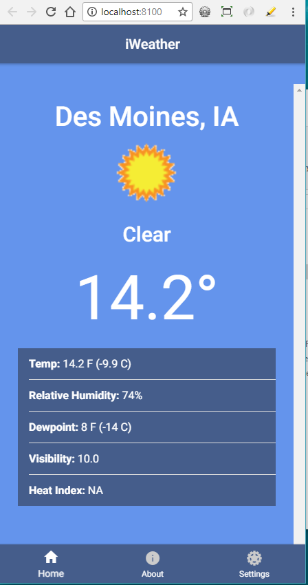
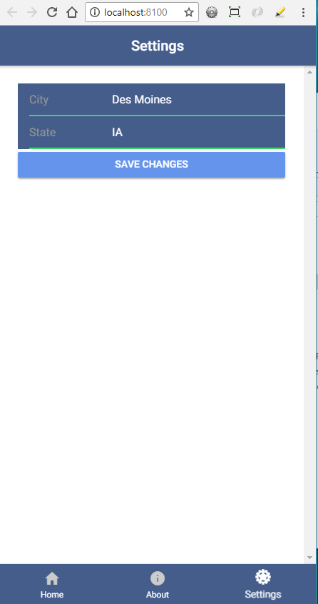

# Weather-App
This is a tutorial I follow on creating a Ionic 3 Weather App.  The program uses uses Angular 4 and .json files.  The tutorial can be found by
though the following link.

https://www.youtube.com/watch?v=qs2n_poLarc

The tutorial uses a API from wunderground.com. I have the free subscription of the website and because of that I am only limit to 10 updates.
Basically everytime the app is run it gets information from the following website and because I don't paid anything it will only do this a certian
time a day.

